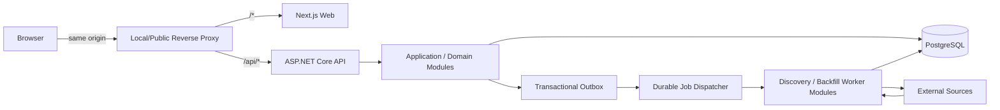

# Architecture: AlphaVoice
> Sources: `docs/01-prd.md`, `docs/01a-ux-spec.md` | Version: 0.2 | Status: VALIDATED — Phase 3 Architecture / Readiness Gate passed | Date: 2026-09-05

## 1. System Overview

AlphaVoice is a responsive, Watchlist-driven web application that discovers and organizes CEO/CFO Public Appearances for followed US-listed companies. The architecture prioritizes **Precision > Coverage > Speed**, shared Global discovery state, per-user Watchlist/Read state isolation, low recurring cost, and a Local-first deployment that can later move to a Public Web App without redesigning the core domain.

The initial system is a **structured monorepo** containing a Next.js frontend and a modular ASP.NET Core backend using PostgreSQL. The backend begins as a **modular monolith in one deployable process**, while durable background work, module boundaries, and container packaging keep a later API/Worker split straightforward. Discovery and historical backfill are background concerns and never sit on the interactive browser request path.



### 1.1 Architectural invariants

1. **One Public Appearance = one Canonical Event.** Multiple Resources remain children of one Event.
2. **Global truth and User state are separate.** Company/Executive/Event/Resource/discovery/backfill are Global where appropriate; Watchlist and Read state are user-scoped.
3. **Uncertain discovery never leaks to regular users.** Candidate and Canonical Event are separate models.
4. **Historical coverage truth is not job state.** Coverage uses source + company + date-range semantics and the PRD `(S,F)` stock-level decision function.
5. **External content is untrusted.** AlphaVoice stores normalized metadata/evidence and original links rather than hosting source media.
6. **Cheap before expensive.** No paid AI, paid data feed, Redis, hosted observability, or other recurring service is introduced without evidence and explicit owner approval.
7. **Local-first must remain Public-ready.** Domain code cannot depend on localhost or local filesystem semantics.
8. **Discovery source set, confidence thresholds, and actual cadences remain provisional until the required Discovery Spike.**

---

## 2. Deployment and Runtime Topology

### 2.1 Initial deployment

The MVP starts as a **Local Web App** to target approximately $0/month infrastructure cost. The local host may pause discovery while the machine is off; when it runs again, durable jobs and coverage state resume/catch up. The PRD does not require a 24/7 discovery SLA.

### 2.2 Local runtime experience

Development and deployed-local runtime are intentionally different:

- **Development:** Next.js native + ASP.NET Core native for hot reload/debugging; PostgreSQL containerized. Browser-facing development must still preserve the same-origin contract: the Next.js development origin proxies/rewrites `/api/*` to the native ASP.NET process. Frontend code calls relative `/api/*` paths; the direct ASP.NET port is reserved for tests/tooling, not normal browser application traffic.
- **Local deployed MVP:** one command/script starts the containerized application stack and opens the browser.
- **Integration/deployment-like testing:** full container composition is available.

The one-command wrapper hides container orchestration from the normal Local MVP usage path; no native desktop launcher is required.

### 2.3 Future public deployment

Production container images are the portable baseline for Web/API/future Worker, but the architecture is **not container-exclusive**. A future hosting provider may use a more economical native deployment mechanism if it preserves contracts and behavior. No cloud vendor is selected in this architecture.

### 2.4 Process evolution

Initial:

```text
ASP.NET Core Host
├─ API endpoints
├─ domain/application modules
├─ outbox dispatcher
└─ background job execution
```

Future, if operational evidence justifies it:

```text
ASP.NET Core API  ─┐
                   ├─ PostgreSQL durable boundary
.NET Worker       ─┘
```

The split must not require domain-model redesign.

---

## 3. Technology Stack

| Layer | Selected direction |
|---|---|
| Frontend | React + Next.js + TypeScript |
| Backend | ASP.NET Core on the latest stable supported .NET LTS at implementation kickoff; no preview runtime |
| Database | PostgreSQL from day one |
| Data access | EF Core primary; explicit SQL/Dapper escape hatch where evidence justifies it |
| Auth session | Server-side AlphaVoice session + secure HttpOnly cookie |
| API | REST, use-case/screen-oriented queries and command endpoints |
| Contract sync | ASP.NET OpenAPI → generated TypeScript client/types |
| Background work | PostgreSQL-backed durable jobs + scheduler |
| Async reliability | PostgreSQL transactional outbox for side effects that must not be lost |
| Observability | Structured logs + metrics + distributed traces, OpenTelemetry-compatible |
| Packaging | Container-ready portable baseline; native dev |

No Redis, RabbitMQ/Kafka, separate search engine, paid AI, or hosted observability service is required for the MVP baseline.

---

## 4. Frontend Architecture

### 4.1 Rendering and data ownership

Next.js owns routing, layouts, responsive shell, Sign-In presentation, and client application composition. Authenticated product data is loaded client-side through same-origin `/api/*` endpoints owned by ASP.NET Core. This avoids creating an implicit Next.js BFF or duplicating business/auth rules in the frontend.

### 4.2 Server state

Timeline, Watchlist, unread counts, Stock Timeline, Event Detail, Candidate Review, and stock search are server state. A dedicated frontend server-state/query layer handles request caching, retry, deduplication, mutations, invalidation, cursor pages, and optimistic UI rollback where applicable. UI-only state stays in React local state. The exact query library is not architecture-locked.

### 4.3 Pagination

- Home Timeline and Stock Timeline use **stable cursor pagination** because chronology can change while the user is browsing.
- Conceptual cursor tie-breaker: `(PrimaryEventDate, EventId)`.
- Filter changes reset pagination.
- Search/Admin bounded lists may use a simpler pagination mechanism where appropriate.
- UX remains **Load more**, not infinite scroll or numbered pages.

### 4.4 Error handling

Frontend behavior depends on stable API error codes, not parsing human-readable messages. Mutations that optimistically update UI, especially Mark Read/Unread, must restore prior visible state when the mutation fails.

### 4.5 Responsive behavior

The frontend must satisfy the validated UX states and PRD viewports at 360×800 and 1280×800. Architecture does not introduce desktop-only controls or embedded external media dependencies.

---

## 5. Backend Modular Monolith

Backend code is organized **business/feature first**, not as global `Controllers/Services/Repositories` folders.

Conceptual modules:

| Module | Owns |
|---|---|
| Identity | AlphaVoice users, external identities, sessions, Admin role bootstrap/policy |
| Stock Universe | Company identity, listing history, eligibility, local stock-search data |
| Watchlists | Follow/unfollow, per-user Watchlist state, EventReadState |
| Executives | Executive identity and effective-dated CEO/CFO role intervals/evidence |
| Events | CanonicalEvent, EventParticipant, Resource, publication/suppression, revisions/merges |
| Discovery | Source registry/adapters, normalized discovery items, Candidates, classification evidence |
| Backfill | 90-day requirements, Attempts, Effective Coverage, stock-level outcome calculation |
| Admin Review | Pending queue/read models and resolve commands coordinating Candidate/Event decisions |
| Operations | Durable jobs, outbox, source health, scheduler/runtime support |
| Audit | Immutable targeted business audit records |

Layers may exist inside a module where useful, but the architecture does not require full Clean Architecture `.csproj` proliferation for every module.

### 5.1 Module database ownership

PostgreSQL uses **schema-per-domain ownership**. Writes must go through the owning module. Explicit cross-schema read projections are allowed for efficient screen queries.

```text
Write boundary = strict
Read boundary  = pragmatic
```

For example, Home Timeline may join `events.*` with `watchlists.*`, but it cannot mutate Watchlist state except through the Watchlists application use case.

### 5.2 Inter-module communication

- Synchronous commands/queries use explicit application boundaries.
- Durable asynchronous side effects use domain/application events.
- Events that must not be lost are written through a transactional outbox in the same PostgreSQL transaction as the source state change.

Example:

```text
Add Stock transaction
├─ create Watchlist relation
└─ write StockFollowed outbox message
COMMIT
    ↓
outbox dispatcher
    ↓
durable Backfill job
```

### 5.3 Cross-module atomic transactions

A use case that must atomically mutate more than one owning module may coordinate **one shared PostgreSQL transaction** across those module operations. The application orchestrator owns transaction lifetime (`BEGIN / COMMIT / ROLLBACK`) only; each module remains exclusively responsible for writes to its own schema. The orchestrator must not bypass ownership by issuing direct cross-schema mutations.

Outbox records required by the use case commit in the same transaction. If any participating module fails, the entire operation rolls back. Integration tests must inject mid-operation failures for critical cross-module flows such as Candidate resolution and published Event merge and prove that Candidate/Event/ReadState/Audit/Outbox state is unchanged after rollback.

---

## 6. Identity, Authentication, Authorization, and Security

### 6.1 User identity

AlphaVoice owns a stable internal `UserId`. Google authentication is mapped through a separate ExternalIdentity record using `(Provider=Google, ProviderSubject=sub)`. Email/display name are profile attributes, not security keys.

### 6.2 Sessions

Google proves identity; AlphaVoice creates an **authoritative PostgreSQL-backed server-side session**. The browser holds only an opaque, high-entropy session identifier in a Secure, HttpOnly, SameSite cookie. JWT access/refresh token architecture is not part of MVP.

Session lifecycle rules:

- server-side expiry is authoritative; lifetime values are configurable;
- logout revokes/deletes the server session and clears the browser cookie;
- revoked/expired session identifiers are rejected even if an old cookie is replayed;
- ASP.NET restart does not invalidate otherwise-active sessions;
- expired/revoked rows are cleaned up with bounded retention;
- if idle-expiry/activity tracking is used, activity persistence must be throttled/coalesced rather than forcing a database write on every request;
- future multiple API instances may share the PostgreSQL session store without introducing Redis by default.

### 6.3 Same-origin boundary

The browser sees one origin:

```text
/*       → Next.js
/api/*   → ASP.NET Core
```

This simplifies cookie, CORS, SameSite, and OAuth behavior. There is no default Next.js BFF. Native development must preserve the same browser-facing model through a development proxy/rewrite from the Next.js origin to ASP.NET `/api/*`; normal frontend code must not switch to direct cross-origin backend URLs or development-only CORS/CSRF exceptions.

### 6.4 CSRF

Unsafe methods (`POST/PUT/PATCH/DELETE`) use layered protection:

1. Secure HttpOnly SameSite session cookie.
2. Origin/Referer validation.
3. Anti-CSRF mechanism at the ASP.NET boundary.
4. Server-side authorization/ownership check.
5. Transaction/constraints.

### 6.5 User-data isolation

The authenticated session supplies the current `UserId`; user IDs supplied by request bodies/query strings are never trusted for ownership. Every per-user operation scopes to the current session user. Database uniqueness/foreign-key constraints reinforce isolation, and integration tests must cover cross-user access attempts.

PostgreSQL RLS is reserved as selective future defense-in-depth, not required initially.

### 6.6 Admin bootstrap

A configured stable Google identity bootstraps the first Admin. After bootstrap, Admin role/permission is persisted against the internal AlphaVoice UserId and enforced through centralized ASP.NET policies. No complex multi-level RBAC or Admin-management UI is required.

### 6.7 API abuse protection

ASP.NET uses policy-based rate limiting:

- authenticated policies keyed primarily by UserId;
- unauthenticated/auth flows keyed by IP/connection context as appropriate;
- endpoint classes may have different limits;
- local/dev limits are generous;
- no distributed limiter/Redis is required until multiple API instances create a measured need.

API rate limiting is separate from outbound source quota management.

---

## 7. Stock Universe and Executive Directory

### 7.1 Stock universe source strategy

Use **exchange-first listing data** for NYSE/Nasdaq/NYSE American universe construction, then cross-validate/enrich with SEC data. The system syncs source data into PostgreSQL; user search never performs a live external call per keystroke.

The architecture preserves:

- stable Company identity;
- Listing identity/history separate from Company;
- eligibility filtering for ETF/Fund/unsuitable instruments;
- delisting without deleting historical Company/Event data.

Exact exchange feeds/files and operational licensing checks are implementation research items and must remain free/low-cost unless explicitly approved.

### 7.2 Company and listing lifecycle

Use stable identity + effective-dated Listing history:

```text
Company
└─ CompanyListing
   ├─ Exchange
   ├─ Ticker
   ├─ EffectiveFrom
   ├─ EffectiveTo
   └─ Status
```

Ticker changes do not create a new Company. Delisting marks current monitoring eligibility without destroying history.

### 7.3 Executive source strategy

Use **SEC-first** evidence plus Company IR/official announcements for verification and temporal detail. Paid executive datasets remain a future fallback only if benchmarked free approaches fail required coverage/temporal accuracy and the owner approves recurring cost.

### 7.4 Executive role model

```text
Executive
└─ ExecutiveRole
   ├─ CompanyId
   ├─ Role = CEO | CFO
   ├─ EffectiveFrom
   ├─ EffectiveTo
   ├─ Evidence
   └─ Validation status
```

Historical Event validation queries the role interval valid on the Event's Primary Event Date. Material corrections to role intervals trigger targeted Event re-evaluation.

---

## 8. Discovery Architecture

### 8.1 Source adapters and registry

Discovery uses a **capability-based Source Adapter + Source Registry** model. A source declares capabilities such as forward discovery, historical discovery, metadata/evidence support, and optional browser rendering.

All adapters emit a **Normalized Discovery Item** into the central Candidate pipeline. Adapters may never create Canonical Events directly.

Conceptual Source Definition fields include:

- identity/type;
- enabled status;
- tier;
- capabilities;
- access method;
- source-specific runtime config;
- min/baseline/max cadence slots;
- rate/quota/cost controls;
- source-health state;
- terms/licensing review state.

### 8.2 Tiered discovery

Use a Tiered Hybrid strategy:

1. structured/known/official low-cost sources first;
2. selective broader discovery/search at controlled frequency/budget;
3. useful broader-discovered sources may later become registered structured sources.

The system must not brute-force broad search for every executive at high frequency.

### 8.3 Candidate validation

Validation is deterministic-first and cheap-first:

```text
Normalized Discovery Item
→ cheap normalization/pre-filter
→ participation / executive / date evidence validation
→ candidate classification
→ duplicate/canonical match
→ Auto-publish | Admin Review | Reject
```

AI/LLM escalation may be evaluated later for uncertain items, but it is not a default MVP dependency and any paid AI path requires owner approval plus benchmark evidence.

Numeric confidence thresholds are **not defined here**; the Discovery Spike must calibrate them.

### 8.4 External access and outbound egress policy

Preferred order:

1. official API;
2. RSS/structured feed;
3. official/public HTML;
4. broader web/search mechanism.

Shared policy governs timeout, rate limits, retries/backoff, quota/cost, eligibility, historical support, evidence retention, and outbound network safety. Source adapters do not independently invent uncontrolled crawling behavior.

All discovered/fetched URLs are untrusted. Shared outbound infrastructure must:

- allow only approved external schemes (normally HTTP/HTTPS);
- reject loopback, private, link-local, unspecified, multicast/reserved/internal destinations after DNS resolution;
- revalidate every redirect destination and bound redirect count;
- apply request/connect timeouts, maximum response/decompression size, and content-type limits appropriate to the adapter;
- apply stricter qualification/policy to discovered-unverified URLs than registered sources;
- validate user-facing external Resource URLs against safe allowed schemes.

Source Registry may classify source trust/registration level for policy purposes, but source content itself always remains untrusted.

### 8.5 HTTP and optional browser fetch

Static HTTP/structured fetching is the default. Architecture exposes an optional isolated `BrowserFetch` capability only if the Discovery Spike proves a selected source requires it and it is reliable, permitted, and cost-effective. Browser runtime is not a default dependency and must live in background execution, never the API request path.

If enabled, `BrowserFetch` is an untrusted-content execution boundary: it must apply the outbound egress rules to navigation and subresource requests, run with bounded process/resource limits, avoid application secrets and unnecessary local-filesystem access, and fail independently from the API process. Network/platform-level egress controls may later add defense in depth but are not required paid infrastructure for the MVP.

### 8.6 Adaptive fetching

Each source has configurable min/baseline/max cadence concepts; the actual values remain Spike-governed. Company+source operational state tracks last attempt/success, next fetch, failures, and productivity.

Bounded deterministic adaptation:

- repeated failure/quota pressure → back off;
- productive source → move toward configured minimum interval;
- repeated no-result cycles → move toward configured maximum interval.

No ML scheduler is required.

### 8.7 Source health and circuit breaker

`Enabled` is configuration; `HealthState` is operational.

```text
Healthy → Degraded → OpenCircuit
```

Failures are classified (transient, rate limit, auth/config, parser/contract). Persistent faults may open the circuit. Controlled probes test recovery. `OpenCircuit` never means historical `Unsupported`; operational health and backfill truth remain separate.

---

## 9. Durable Jobs, Outbox, and Monitoring Activation

### 9.1 Durable jobs

PostgreSQL is the durable job store. Workers claim jobs transactionally, record bounded failures, and can resume after process restart. No Redis/RabbitMQ/Kafka dependency is required.

Job status is operational state only; it never determines historical coverage outcome.

### 9.2 Idempotency

Layered idempotency includes:

- deterministic operation/job keys;
- PostgreSQL unique constraints;
- transactions/upserts;
- idempotent command semantics for retry;
- semantic duplicate handling delegated to canonicalization rather than generic DB uniqueness.

### 9.3 Demand-driven monitoring

A company is actively monitored only while at least one user follows it. When follower count reaches zero, the system enters a configurable short pending-deactivation/grace state. After expiry it stops scheduling unnecessary new forward work but retains reusable Global Events, Candidates, coverage, and source state.

Re-following reactivates monitoring and computes only uncovered historical date ranges. Work already executing may complete or cooperate with cancellation at a safe boundary; it is not hard-killed inside a transaction.

---

## 10. Historical Backfill and Coverage Model

Historical truth is modeled as:

```text
Job ≠ Attempt ≠ Effective Coverage
```

### 10.1 Required window

`FollowedAt` is an authoritative UTC timestamp. Derive `FollowDate` from its **UTC calendar date**, then define the canonical historical coverage window as:

```text
[FollowDate - 90 calendar days, FollowDate]
```

Both endpoints are inclusive. Source adapters translate this canonical `DATE` interval into source-specific request semantics (inclusive/exclusive dates or timestamps), while Attempt/Evidence records retain the canonical AlphaVoice range. Benchmark fixtures must use the same conversion rule. This UTC rule applies only to Follow→coverage-window derivation; `PrimaryEventDate` retains its evidence-based business-date semantics.

### 10.2 Attempt history

Every requested company/source/date-range segment records immutable attempt evidence and one outcome:

- `Succeeded`
- `Failed`
- `Unsupported`

A successful request that finds zero eligible Events is still `Succeeded`.

### 10.3 Effective Coverage

The authoritative reuse model is a normalized set of non-overlapping effective coverage intervals per company/source. Adjacent successful intervals can merge; failures remain targetable gaps; a later retry success can normalize into a larger successful interval.

A later Follow computes:

```text
Required Window
- Effective Succeeded Coverage
= Uncovered source/date ranges only
```

### 10.4 Stock-level status

The architecture must implement the PRD's single authoritative `(S,F)` function exactly:

| S | F | Outcome |
|---|---|---|
| Yes | No | Complete |
| Yes | Yes | Partial |
| No | Yes | Failed |
| No | No | Unsupported |

Unsupported segments do not introduce a third variable and never override `(S,F)`.

---

## 11. Candidate, Canonical Event, Participant, and Resource Model

### 11.1 Candidate vs Event

Candidate and CanonicalEvent are separate domain models.

Candidate owns discovered/proposed data, uncertainty, evidence, and review state. Regular users query only published Canonical Events. Resolve behavior:

- Approve/auto-approve → create or reconcile authoritative Event/Resource/Participant state;
- Merge → reconcile the Candidate into an existing Event, including eligible Resources/evidence **and validated EventParticipant assertions**;
- Reject → retain Candidate/audit evidence without user visibility.

Candidate Merge must normalize Executive/Company identity, confirm actual participation, validate `RoleAtEvent` against effective-dated role history, retain supporting validation evidence, and deduplicate participant associations. Uncertain/conflicting participant assertions do not silently enter a Canonical Event; they remain on the Admin/correction path.

### 11.2 Multi-company appearances

CanonicalEvent is global and can have multiple participant associations:

```text
EventParticipant
├─ CanonicalEventId
├─ ExecutiveId
├─ CompanyId
├─ RoleAtEvent = CEO | CFO
├─ ParticipationType
└─ ValidationEvidence
```

Only actual participation creates the association; mention-only content does not. The same Event may appear in multiple Stock Timelines but appears once in a user's Unified Feed.

### 11.3 Canonicalization layers

1. exact Resource identifiers/URLs;
2. strong deterministic Event signals;
3. fuzzy/multi-signal matching;
4. ambiguous cases → Admin Merge Review.

Resource dedup and Event canonicalization are separate concerns.

### 11.4 Resource model

Resource classification separates:

- **Role:** Primary, Transcript, Clip, RelatedCoverage, Supporting;
- **Media Type:** Video, Audio, Article, Transcript, EventPage, Other;
- **Provenance:** Host/Organizer, Company Official, Executive Official, Established Publisher, Third-party, Unknown.

Primary action ranking is deterministic and favors Primary role + strong provenance + full/original consumability. A Resource can disappear without invalidating Event identity.

### 11.5 Resource availability

Store `Unknown / Available / Unavailable` plus optional last-check/evidence metadata. Verification is opportunistic and bounded using normal source activity and only suitable low-frequency probes. AlphaVoice does not continuously ping every URL.

### 11.6 Event correction and revision

Canonical Event stores current authoritative state plus explicit material revision/audit records. Material date corrections re-run role-at-date and date-dependent canonical logic. Metadata correction does not reset Read state when Event identity is unchanged.

### 11.7 Event merge after publication

When two published Event identities are discovered to represent one Appearance:

- choose one survivor Canonical Event;
- keep losing Event IDs as merged aliases/redirects;
- reconcile **EventParticipants**, participant evidence, Resources, and authoritative metadata transactionally;
- validate participant actual-participation and role-at-event rather than blindly unioning associations; unresolved participant conflicts follow the Admin/correction path;
- reconcile Read state with logical OR (read either duplicate → survivor read);
- preserve audit/deep-link history;
- normalize alias chains and prevent cycles.

Survivor identity does not automatically win every metadata field; authoritative facts are re-evaluated from evidence. The entire published merge follows the shared cross-module transaction rule in §5.3.

### 11.8 False-positive suppression

A published Event later proven ineligible is **Suppressed**, not hard-deleted or reclassified into a fake valid Event. Regular-user queries return Published only; suppressed records/evidence remain for audit, Precision analysis, and possible later correction.

---

## 12. Date and Time Semantics

Business chronology and operational chronology are separate.

### 12.1 Business dates

Use database `DATE` semantics for:

- PrimaryEventDate;
- Resource PublishedDate when only a date is known;
- Role EffectiveFrom/EffectiveTo;
- Listing EffectiveFrom/EffectiveTo;
- backfill inclusion and role-at-event checks.

PrimaryEventDate retains its basis (`actual_event_date` or `published_date_fallback`).

### 12.2 Optional source timestamps

If reliable evidence provides actual clock time/timezone, store optional source timestamp/timezone metadata without replacing the business-date semantics.

### 12.3 Operational timestamps

CreatedAt, DiscoveredAt, UpdatedAt, JobStartedAt, NextFetchAt, etc. are UTC timestamps.

---

## 13. Read/Unread and Future Notifications

### 13.1 MVP unread model

No notification row is required per User×Event. Unread is derived from:

```text
Current Watchlist relevance
+ Published Canonical Event
+ EventReadState
```

No EventReadState means unread for an eligible/relevant Event.

### 13.2 Persistent reading history

`EventReadState(UserId, CanonicalEventId)` is persistent reading history independent of Watchlist lifecycle. Unfollow removes the Follow relation but does not delete reading history; re-follow restores prior read/unread truth.

### 13.3 Read triggers

Opening Event Detail or selecting Watch/Read Original/Transcript marks the Event Read. The read mutation must not wait for an external URL availability probe. Merely scrolling never changes Read state.

### 13.4 Future notification domain

Email/push are out of MVP. If later added, Notification/Delivery becomes a separate domain so delivery state is not conflated with EventReadState. For example, an email may be Delivered while the Event remains Unread.

---

## 14. API Contracts

### 14.1 API shape

REST endpoints are use-case/screen oriented. Backend DTOs/projections are explicit and EF entities are not exposed directly.

Conceptual query families:

- session/current user;
- Home Timeline;
- Watchlist + unread counts;
- stock universe search;
- Stock Timeline + backfill status;
- Event Detail;
- Admin Review Queue;
- Candidate Review + merge suggestions/search.

Conceptual command families:

- Follow/Unfollow;
- Mark Read/Unread;
- Candidate Approve/Reject/Merge;
- logout/session operations.

Exact paths/names are implementation-level and may be fixed during story design without changing architectural ownership.

### 14.2 Error contract

Domain/application code uses typed errors. API boundary maps them to HTTP status + stable error envelope, e.g.:

```json
{
  "code": "candidate_already_resolved",
  "title": "Candidate is no longer pending",
  "traceId": "...",
  "details": {}
}
```

`409 Conflict` is used for stale/resolve-once concurrency conflicts where appropriate.

### 14.3 Admin optimistic concurrency

Candidate Review uses optimistic concurrency. Resolve operations verify Pending/current version in one transaction and can succeed only once. The transaction covers Event/Resource changes, Candidate resolution, Audit, and required outbox writes. Stale tabs receive a conflict instead of overwriting the first decision.

### 14.4 Contract generation

ASP.NET owns the OpenAPI contract. CI generates TypeScript client/types and fails on uncommitted/unexpected drift. Generated code is not hand-maintained.

---

## 15. Query and Search Strategy

### 15.1 Stock search

Use PostgreSQL indexed ticker/company search with ranking:

1. exact ticker;
2. ticker prefix;
3. exact company name;
4. company-name prefix;
5. trigram/fuzzy fallback.

The same mechanism can serve Universe and user-Watchlist search with different scopes. No Elasticsearch/Algolia-style search service is required.

### 15.2 Timeline projections

Timeline read models are explicit cross-domain projections joining Events/Participants with current user's Watchlist and Read state. Cursor indexes must support newest-first ordering and deterministic tie-breaking under the reference dataset.

### 15.3 Watchlist ordering

Watchlist projection calculates unread counts and sorts by:

1. unread count descending for non-zero unread;
2. ticker A–Z;
3. zero-unread stocks below, ticker A–Z.

No design may require rendering all 100+ stock histories at once; Watchlist rows and Timeline results are bounded projections.

---

## 16. External Content, Evidence, and Traceability

### 16.1 Minimal evidence snapshot

Store only enough source data to classify, review, canonicalize, trace, and later audit an Event, for example:

- canonical/source URL or external ID;
- source identity;
- source title;
- published/business date evidence;
- source-provided description/excerpt;
- normalized participant/executive evidence;
- discovered time;
- bounded evidence fragment;
- evidence version/hash where useful.

Full articles/videos/transcripts are not copied by default.

### 16.2 Safe rendering

External content is untrusted. Titles/descriptions/snippets render as normalized plain text by default. Limited rich content is allowed only through explicit sanitization/allowlist rules. Arbitrary script, iframe, inline handlers, embedded HTML, or style injection are not allowed, including in Admin views.

### 16.3 Source traceability

Every Canonical Event must retain at least one Source/Resource trace. Event identity survives individual Resource failure.

---

## 17. Data Retention, Backup, and Migration

### 17.1 Retention by data class

- Canonical Events/Resources, Company/Listing history, Executive Roles, Admin decisions, material revisions: long-lived.
- Discovery Candidates/evidence: retained for audit and Precision tuning; may be compacted/archived only under future evidence-backed policy.
- Job/fetch operational history: bounded configurable retention.
- Runtime logs: short/rotating retention.
- Outbox Pending/Failed: never cleanup as routine retention.
- Outbox processed: cleanup after a configurable safety window.

### 17.2 Backup and restore

Local MVP performs automated local PostgreSQL backups through a destination abstraction. Future Public deployment may use off-device/managed backup without application redesign. Backup is not considered proven until a repeatable restore procedure successfully restores into disposable PostgreSQL and passes integrity/smoke checks.

### 17.3 Schema migration

Use versioned forward EF Core migrations as baseline, with reviewed explicit SQL where required. Migrations are a controlled release step, not something every ASP.NET instance performs automatically on startup.

Local one-command startup may orchestrate:

```text
preflight → schema check → backup when required → migration → validation → start
```

Future Public release runs a one-time migration job before starting/rolling application instances. Recovery favors corrective forward migration or tested backup restore rather than assuming every `Down()` migration is lossless.

---

## 18. Configuration and Secrets

Configuration is layered:

1. version-controlled non-secret application configuration;
2. environment/deployment overrides;
3. externalized secret provider;
4. runtime source configuration in PostgreSQL for values that must change without redeploy.

Examples of runtime source configuration: enabled, cadence range, quota/budget controls, source policy state. Secrets such as Google OAuth secret, API keys, and database passwords are never committed to Git. Local development may use local secret mechanisms; future Public deployment may use a platform secret store without changing application code.

---

## 19. Observability and Evidence

### 19.1 Runtime observability

Use structured logs, metrics, and distributed traces with OpenTelemetry-compatible instrumentation. No hosted SaaS is required for MVP.

Key operational metrics include source requests/failures/quota use, candidates, classification outcomes, discovery delay, canonical merge rates, admin queue age, job duration/failures, outbox lag, backfill outcomes, and query latency.

### 19.2 Benchmark evidence

Benchmark evidence is separate from runtime observability. Frozen/reproducible artifact sets record benchmark version/config/results for Discovery Precision/Coverage, Duplicate resistance, Backfill semantics, UI performance, and cost.

The Discovery benchmark must meet the PRD composition rules (≥20 companies, ≥100 reviewed items if expansion is necessary, fixed 90-day window, negatives, duplicates/cross-source examples) before final measurement.

---

## 20. Repository, Build, and CI

### 20.1 Structured monorepo

Conceptual layout:

```text
alphavoice/
├─ apps/
│  ├─ web/                 # Next.js
│  └─ api/                 # ASP.NET Core host
├─ backend/
│  └─ modules/             # business-first modules
├─ contracts/
│  └─ generated/           # OpenAPI-derived TypeScript artifacts/process
├─ infra/
│  ├─ containers/
│  └─ local-runtime/
├─ tests/
│  ├─ integration/
│  ├─ e2e/
│  └─ benchmarks/
└─ docs/
```

Final folder naming may be refined during scaffolding; business ownership and independent build boundaries must not change silently.

### 20.2 Tiered CI

**Gate 1 — deterministic/cheap**
- formatting/lint;
- frontend type-check;
- .NET build;
- unit/domain tests;
- OpenAPI generated-client drift check.

**Gate 2 — integration/security/build**
- fresh PostgreSQL migration application;
- PostgreSQL integration tests;
- job/outbox/idempotency/concurrency tests;
- cross-module atomic rollback tests with injected mid-operation failures;
- Candidate/published Event merge tests covering differing valid/invalid EventParticipants;
- outbound-fetch SSRF tests covering private/local destinations and redirect revalidation;
- FollowedAt→UTC FollowDate inclusive-window boundary fixtures;
- session persistence/logout/revocation tests;
- same-origin development proxy behavior for browser-facing flows;
- authorization/cross-user isolation tests;
- container builds.

**Gate 3 — selected critical E2E**
- Sign-In boundary;
- Follow → Stock Timeline → Read;
- Admin Review Approve/Reject/Merge;
- relevant backfill reuse/status flow.

**Gate 4 — controlled evidence suites**
- Discovery;
- Backfill;
- Canonicalization/Duplicate;
- UI Performance;
- Cost.

Live external-source validation is controlled/on-demand; normal CI uses deterministic adapter fixtures/contract tests so external outages do not break unrelated changes.

---

## 21. Testing Strategy

1. **Unit/domain tests:** `(S,F)` outcome, interval math, role-at-date, classification/canonical primitives, ranking/state rules.
2. **PostgreSQL integration:** migrations, constraints, transactions, EF/Dapper queries, durable jobs, outbox, idempotency, concurrency.
3. **HTTP authorization integration:** cross-user access, Admin-only endpoints, CSRF/auth boundaries.
4. **Contract checks:** OpenAPI → generated TS client/types.
5. **Selected E2E:** validated core flows only; not every permutation.
6. **Reproducible benchmark/evidence suites:** Discovery, Backfill, Duplicate, Performance, Cost.

In-memory database substitutes are not sufficient for behaviors that depend on PostgreSQL constraints/transactions/query semantics.

---

## 22. FR-to-Architecture Mapping

| FRs | Architectural coverage |
|---|---|
| FR-1–3 | Identity module, Google ExternalIdentity mapping, server-side session, logout, same-origin auth boundary |
| FR-4–7 | Stock Universe module, exchange-first + SEC sync, PostgreSQL search, Watchlists, demand-driven monitoring |
| FR-8–9 | Executives module, effective-dated ExecutiveRole, business-date semantics, re-evaluation on correction |
| FR-10–12 | Discovery Source Registry/adapters, durable jobs, adaptive fetching, EventType classification |
| FR-13–16 | Candidate model, deterministic validation pipeline, Auto-publish/Admin Review/Reject separation |
| FR-17–18 | Layered canonicalization, Resource dedup, CanonicalEvent + Resource model, D56 alias merge safety |
| FR-19–20 | centralized Admin policy, one-primary-Admin bootstrap, Candidate review isolation/concurrency |
| FR-21–24 | durable Backfill module, Attempt + Effective Coverage, `(S,F)` outcome, reuse, forward tracking |
| FR-25–30 | screen-oriented Timeline/Watchlist/Stock projections, cursor paging, filters, indexed search/read state |
| FR-31–35 | Event Detail projection, Resource role/type/provenance, original links, safe excerpts, availability state |
| FR-36–40 | EventReadState, derived unread, persistent read history, mutation rollback/error contract |
| FR-41 | Next.js responsive shell + UX states + NFR performance/responsive validation suites |

No FR requires a new unapproved recurring-cost infrastructure dependency.

---

## 23. UX Screen-to-Contract Mapping

| UX Screen | Main backend data/contracts |
|---|---|
| Sign In | auth start/callback/session/current-user/logout; no user data on signed-out surface |
| Home Timeline | cursor Timeline projection joining Events/Participants/Watchlist/ReadState; All/Unread/CEO-CFO/EventType filters |
| Home Watchlist | user Watchlist projection + unread counts + local Watchlist search/sort; Follow/Unfollow commands |
| Stock Search/Add | indexed Stock Universe search + following state + Follow command |
| Stock Timeline | company Event projection + filters + cursor + independent backfill status |
| Event Detail | Canonical Event + Participants + dates/basis + Resources + read state; Mark Read/Unread |
| Admin Review Queue | pending Candidate projection, oldest-first, Admin policy |
| Admin Candidate Review | Candidate/evidence/date/role/source + plausible Event matches/search + Approve/Reject/Merge commands |

Every screen's Loading/Empty/Error/Normal state is provided by independent query/command status; backfill status does not block existing Event results.

---

## 24. NFR Mapping

| NFR | Architecture / validation mechanism |
|---|---|
| NFR-1 Operating Cost | Local-first baseline; PostgreSQL-backed jobs; no Redis/broker/search engine/paid AI; cost benchmark under reference envelope |
| NFR-2 Cost Governance | no recurring service added without owner decision; provider-neutral deployment |
| NFR-3 Precision | Candidate isolation, deterministic-first validation, Admin uncertainty path, frozen Discovery benchmark |
| NFR-4 Coverage | tiered Source Registry, capability adapters, optional bounded BrowserFetch; frozen Discovery benchmark |
| NFR-5 Authorization | internal UserId, centralized policies, per-user scoping, integration tests, Admin isolation |
| NFR-6 Watchlist Capacity | indexed PostgreSQL search/count projections, bounded screen queries, 100+ benchmark dataset |
| NFR-7 Responsive UX | Next.js responsive shell; UX acceptance at 360×800 and 1280×800 |
| NFR-8 UI Performance | screen projections, cursor paging, DB indexes, client query layer; p95 benchmark per PRD |
| NFR-9 Duplicate Resistance | layered canonicalization, Resource uniqueness/idempotency, duplicate benchmark, survivor-alias merge |
| NFR-10 Fetch Configurability | Source Registry + PostgreSQL runtime source config |
| NFR-11 Source Traceability | Minimal Evidence Snapshot + mandatory Source/Resource relation |
| NFR-12 Data Integrity | DB constraints + application invariants; Event requires Company/Participant role/date basis/Resource |
| NFR-13 Evidence | separate frozen benchmark artifacts and controlled evidence gates |
| NFR-14 Shared Efficiency | global monitoring state, follower-driven activation, global coverage reuse, idempotent jobs |

NFR-3/NFR-4 and Discovery-dependent cost/source claims remain provisional until the mandatory Discovery Spike.

---

## 25. Key Decisions

| # | Decision | Selected direction | Why / rejected direction summary |
|---|---|---|---|
| D1 | Deployment | Local Web first, Public-ready | Near-$0 start; domain kept deployment-neutral. Public-first deferred. |
| D2 | Runtime topology | Modular monolith, worker-separable | Simple MVP without sacrificing later API/Worker split. |
| D3 | Database | PostgreSQL from day one | Strong relational/transaction/range/query semantics and migration path. |
| D4 | Session | Server-side session + HttpOnly cookie | Same-origin web app does not need JWT complexity. |
| D5 | Stack | React/Next.js/TypeScript + ASP.NET Core/.NET LTS | Owner-selected web stack; separate frontend/backend responsibilities. |
| D6 | Browser/API boundary | Same origin, no default BFF | Simplifies cookies/CORS/OAuth and avoids redundant Next backend logic. |
| D7 | Jobs | PostgreSQL durable jobs/scheduler | Durable restart/retry without broker/Redis recurring infrastructure. |
| D8 | Data access | EF Core primary + SQL/Dapper escape hatch | Productivity with explicit performance/query escape path. |
| D9 | Stock source | Exchange-first + SEC cross-validation | Free/low-cost local universe with authoritative enrichment. |
| D10 | Executive source | SEC-first + IR/official verification; paid fallback future | Temporal evidence first; cost fallback only with approval. |
| D11 | Discovery acquisition | Tiered Hybrid | Structured cheap sources first; controlled broader discovery for coverage. |
| D12 | Candidate validation | Deterministic-first; optional AI escalation later | Precision/cost control; thresholds benchmarked, not guessed. |
| D13 | Canonicalization | Layered Event/Resource canonicalization | Exact signals first, fuzzy later, ambiguous → Admin. |
| D14 | Backfill truth | Range coverage + immutable attempts + normalized effective coverage | Supports exact reuse/retry and PRD `(S,F)` semantics. |
| D15 | API style | REST + screen/use-case query/command endpoints | Backend owns sorting/filter/read/auth semantics; DTOs fit UX. |
| D16 | Pagination | Stable cursor for timelines | Robust chronology under changing data; supports Load more. |
| D17 | Source architecture | Capability adapters + Source Registry | New sources vary by forward/history/access without branching core logic. |
| D18 | Fetch scheduling | Configurable adaptive bounds | Bounded deterministic adaptation; numeric cadence deferred to Spike. |
| D19 | Cache | PostgreSQL-first + optional in-process cache | Avoid premature Redis; correctness state remains authoritative in DB. |
| D20 | Frontend fetching | Hybrid shell + client authenticated data | Avoid SSR/BFF auth duplication while preserving Next routing/layout. |
| D21 | Isolation | Centralized ASP.NET ownership + DB constraints | UserId never trusted from client; RLS future-selective. |
| D22 | Idempotency | Layered keys/constraints/transactions/upserts | Handles retries/concurrency without confusing semantic duplicates. |
| D23 | Observability/evidence | OTel-compatible logs/metrics/traces + separate benchmark artifacts | Operational diagnosis and reproducible product evidence are distinct. |
| D24 | Content retention | Minimal Evidence Snapshot | Trace/audit without copying full external media/content. |
| D25 | Contract sync | OpenAPI → generated TypeScript client/types | Prevents C#/TS contract drift. |
| D26 | Developer runtime | Native Web/API + container PostgreSQL; full Compose available | Best hot reload/debug with reproducible integration stack. |
| D27 | Frontend state | Dedicated server-state/query layer + React local state | Clear server truth and mutation/invalidation behavior. |
| D28 | CSRF | SameSite cookie + Origin/Referer + anti-CSRF unsafe-method guard | Defense in depth for cookie-authenticated writes. |
| D29 | Admin bootstrap | Config bootstrap → persisted DB role/policy | Stable initial Admin without hard-coded email auth logic. |
| D30 | Event correction | Authoritative current state + material revision/audit + re-evaluation | Traceable correction without full event sourcing. |
| D31 | Testing | Layered unit/integration/auth/contract/E2E/benchmark | Matches risk surfaces; external benchmarks separated from normal CI. |
| D32 | Stock search | PostgreSQL indexed ticker/name + trigram/fuzzy | Meets 100+ UX/reference scale without search service. |
| D33 | Executive roles | Explicit effective-dated role intervals | Directly supports role-at-event and interim/history corrections. |
| D34 | Candidate/Event boundary | Separate Candidate and CanonicalEvent domains | Prevents unreviewed uncertainty leaking to users. |
| D35 | Unread/notifications | Derived unread; future Notification domain separate | Avoid per-user Event fanout; delivery and reading are different future states. |
| D36 | Backup | Automated local + pluggable off-device future + restore test | $0-first while establishing real recovery discipline. |
| D37 | Config/secrets | Layered config + external secrets + runtime source config | Secure, configurable, Public-ready without paid secret service. |
| D38 | External access | Structured-first + governed HTML/web fallback | Coverage flexibility without uncontrolled crawling/quota behavior. |
| D39 | Module communication | Direct sync + events/outbox for durable async side effects | Simple monolith today; reliable worker separation path tomorrow. |
| D40 | Resource availability | Opportunistic + bounded verification | UX can show detected failures without high-volume link checker. |
| D41 | Date/time | Business DATE + optional source timestamp; operations UTC | Prevents timezone corruption of backfill/role/event-day semantics. |
| D42 | Errors | Typed domain/application errors + standard HTTP envelope | Stable frontend behavior, testability, trace correlation. |
| D43 | Backend organization | Business/feature modules | Real modularity without full-project-per-layer overengineering. |
| D44 | Local runtime | One-command scripted containerized runtime | User-friendly Local MVP without building a desktop launcher. |
| D45 | Packaging | Container-ready, not container-exclusive | Portable Public path while retaining low-cost provider options. |
| D46 | Resource classification | Role + media type + provenance + deterministic ranking | Correct Original/Transcript/coverage actions across varied sources. |
| D47 | Universe/executive lifecycle | Stable IDs + effective-dated history + material-change sync | Preserves historical truth through ticker/role changes/delisting. |
| D48 | Data retention | Data-class policies | Keep product/audit evidence while bounding operational noise. |
| D49 | DB migration | Controlled versioned forward migrations | Safe Local one-command UX and future multi-instance deploy discipline. |
| D50 | Source failures | Explicit health/circuit breaker/failure classes/recovery probes | Prevent quota/worker storms without corrupting coverage semantics. |
| D51 | Audit | Targeted immutable business audit | Trace meaningful decisions without full DB audit/event sourcing noise. |
| D52 | External rendering | Plain text default + strictly sanitized limited rich content | Untrusted-source XSS protection with limited formatting escape hatch. |
| D53 | User identity | Internal UserId + external identity mapping | Keeps business domain independent from email/Google provider keys. |
| D54 | API rate limits | Policy-based User/IP limits | Public-ready abuse protection without Redis in single-instance MVP. |
| D55 | Admin concurrency | Optimistic + DB resolve-once + 409 stale conflict | Prevents double resolve without lock/lease complexity. |
| D56 | Published duplicate merge | Survivor Event + alias/redirect | One active identity while preserving deep links/audit/read state. |
| D57 | Repository | Structured monorepo | Simplifies cross-stack story/contract/CI while deployments remain independent. |
| D58 | CI | Tiered deterministic/integration/E2E/evidence gates | Strong correctness without making external live sources block every PR. |
| D59 | Re-follow read history | Persistent EventReadState independent of Watchlist lifecycle | Re-follow does not create false unread floods. |
| D60 | Monitoring lifecycle | Demand-driven + deactivation grace + retained global state | Stops no-demand cost while avoiding churn and preserving reuse. |
| D61 | Multi-company Event | Global Event + explicit EventParticipant associations | One Appearance remains one Event across multiple participating companies. |
| D62 | DB module boundary | Schema-per-domain write ownership + controlled cross-read projections | Real module ownership without microservice-style query ceremony. |
| D63 | Dynamic HTML | HTTP-first; optional isolated BrowserFetch after Spike evidence | Lightweight baseline while keeping a bounded coverage escape hatch. |
| D64 | False-positive published Event | Published/Suppressed lifecycle + audit | Protects Feed Precision without deleting valuable false-positive evidence. |

---

## 26. Readiness Remediation Decisions

Independent Architecture / Readiness Validation identified three MAJOR and three MINOR gaps. The owner resolved all six without changing the validated PRD/UX or core architecture direction:

| Ref | Remediation | Locked rule |
|---|---|---|
| AV-ARCH-01 | Cross-module atomicity | Application use case coordinates one shared PostgreSQL transaction; each owning module performs only its own schema writes; related outbox commits atomically. |
| AV-ARCH-02 | Participant-aware merge | Candidate and published Event merges reconcile validated EventParticipant identity/participation/role/evidence, not Resources alone or blind unions. |
| AV-ARCH-03 | Outbound-fetch security | Governed egress: safe schemes, DNS/IP checks, redirect revalidation, bounded fetches, trust levels, isolated BrowserFetch. |
| AV-ARCH-04 | Follow date conversion | UTC `FollowedAt` → UTC `FollowDate`; `[D-90,D]` inclusive; adapters translate only at source boundary. |
| AV-ARCH-05 | Session lifecycle | PostgreSQL-backed authoritative sessions with configurable expiry, explicit logout/revocation, bounded cleanup. |
| AV-ARCH-06 | Dev same-origin | Browser-facing native development proxies/rewrites `/api/*` through the Next.js origin; no normal cross-origin app flow. |

These changes were independently rechecked on 2026-09-05. All six findings (3 MAJOR, 3 MINOR) were verified **CLOSED**, with no new material regression findings. The Phase 3 Architecture / Readiness Gate is **PASSED**. This authorizes Phase 4 implementation planning under BMAD; coding still requires the normal Story / Context Budget / Review gates.

---

## 27. Discovery-Dependent Decisions That Remain Provisional

The architecture intentionally does **not** invent final answers for PRD OQ-4/OQ-5/OQ-6.

### 27.1 MVP Discovery Source Set

Must be selected from Discovery Spike evidence considering Precision, Coverage, source contribution, API/RSS availability, terms/licensing, quota, historical support, delay, and operating cost.

### 27.2 Confidence thresholds

Auto-publish / Admin Review / Reject numeric boundaries must be calibrated against the frozen benchmark. The architecture only defines the three outcome paths and evidence model.

### 27.3 Actual fetch cadences

Source-specific cadence values must be determined from observed update frequency, API limits, budget, and discovery delay. The architecture provides configurable bounded adaptive scheduling but no guessed numbers.

### 27.4 Discovery validation gate

Before Discovery design/source choices are treated as final, the Spike must report at least Candidate count, true appearances, false positives, misses, Precision, Coverage, duplicate grouping accuracy, backfill outcomes/reuse, source contribution, discovery delay, API/quota use, and estimated recurring cost under the PRD reference envelope.

---

## 28. Technical Risks and Mitigations

| Risk | Mitigation / required evidence |
|---|---|
| Discovery misses distributed appearances | Tiered source architecture + source contribution benchmark; exact source set remains Spike-controlled |
| False positives | Candidate/Event separation, deterministic-first validation, Admin uncertainty queue, suppression lifecycle, Precision benchmark |
| Duplicate appearances | layered canonicalization, Resource dedup, Admin merge, published-survivor alias model, duplicate benchmark |
| External source instability | governed adapters, source health/circuit breaker, fixture tests, controlled live-source validation |
| Executive/date inaccuracies | effective-dated roles, date basis retention, targeted re-evaluation, audit evidence |
| Backfill semantic drift | explicit Attempt/Effective Coverage model + authoritative `(S,F)` unit/integration fixtures |
| Multi-user leaks | internal UserId, centralized authorization, per-user scoping, DB constraints, mandatory negative integration tests |
| Local machine downtime | durable jobs/outbox/coverage state resume; no promise of 24/7 local discovery |
| Cost creep | no paid default services, runtime source budgets, cost benchmark, owner approval gate for recurring cost |
| PostgreSQL data loss/migration issue | automated backup, tested restore, controlled migration step |
| Public scaling assumptions | reference envelope first; Redis/broker/distributed services added only after measured bottleneck/need |

---

## 29. Readiness / Implementation Guardrails

- This document is **VALIDATED**: the independent targeted readiness recheck passed on 2026-09-05 with AV-ARCH-01 through AV-ARCH-06 CLOSED and no new material regressions.
- No implementation should begin from an unreviewed assumption that contradicts a Key Decision.
- Phase 4 stories must be self-contained, sized to one focused session, and copy the relevant decision rationale into their `WHY` sections.
- Discovery-source implementation stories must clearly mark which choices are provisional pending the Discovery Spike.
- Any new recurring-cost service requires explicit owner approval before it appears in an implementation story.
- If implementation reality contradicts this architecture, stop the story and follow the BMAD architecture-escalation/ADR flow before changing code against the artifact.

---

## 30. Changelog

- **0.2 — 2026-09-05:** Targeted readiness remediation after independent validation (0 BLOCKER / 3 MAJOR / 3 MINOR). Added shared cross-module transaction orchestration, participant-aware merge semantics, outbound SSRF/egress controls, deterministic UTC FollowDate coverage conversion, PostgreSQL-backed session lifecycle, and same-origin native-development proxy requirements. Independent targeted recheck subsequently closed AV-ARCH-01 through AV-ARCH-06 with no new material regressions; Phase 3 Architecture / Readiness Gate PASSED. Phase 4 planning is authorized; coding remains subject to BMAD Story / Context Budget / Review gates.
- **0.1 — 2026-09-03:** Initial architecture draft after owner resolution of D1–D64. Mapped PRD FR-1–FR-41, UX Screen Inventory, and NFR-1–NFR-14; preserved Discovery Source Set, confidence thresholds, and numeric fetch cadence as mandatory Spike-governed decisions.
